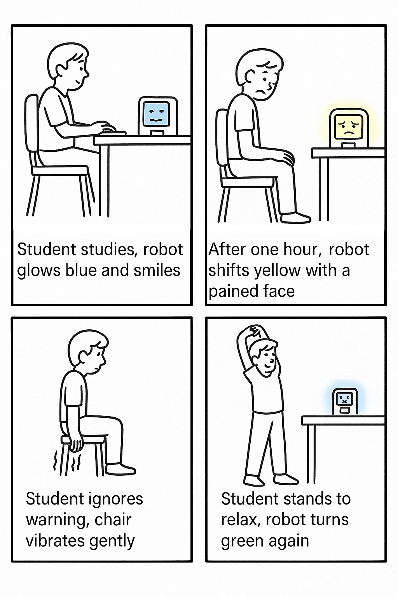
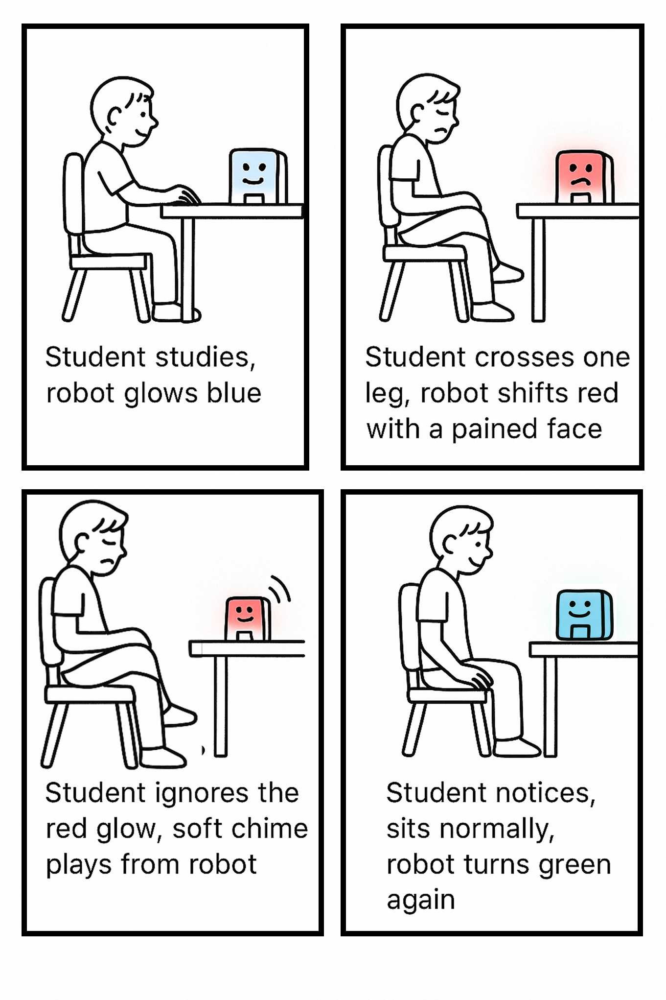
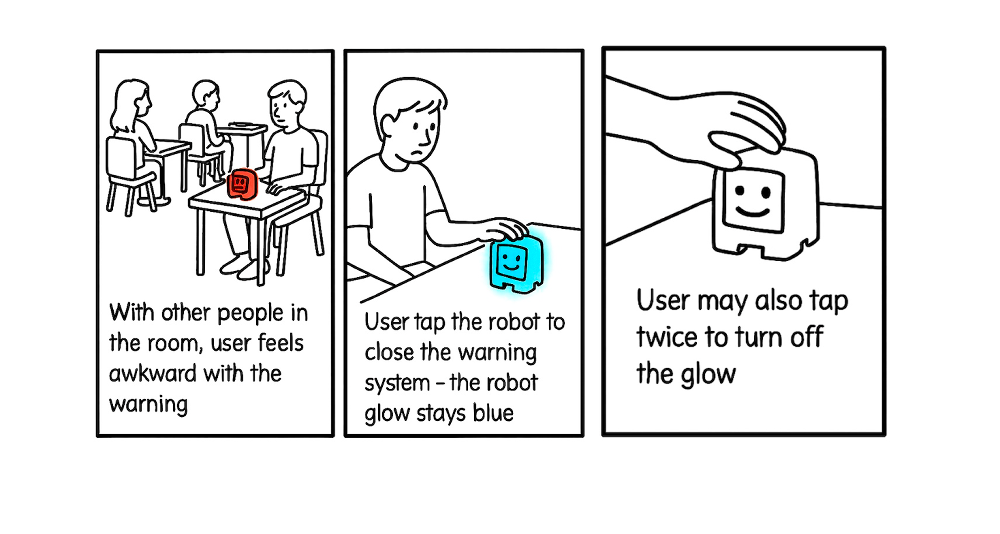
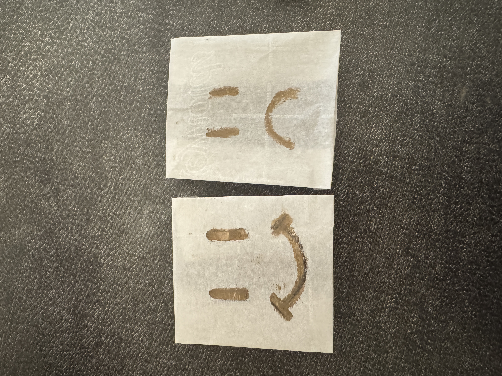
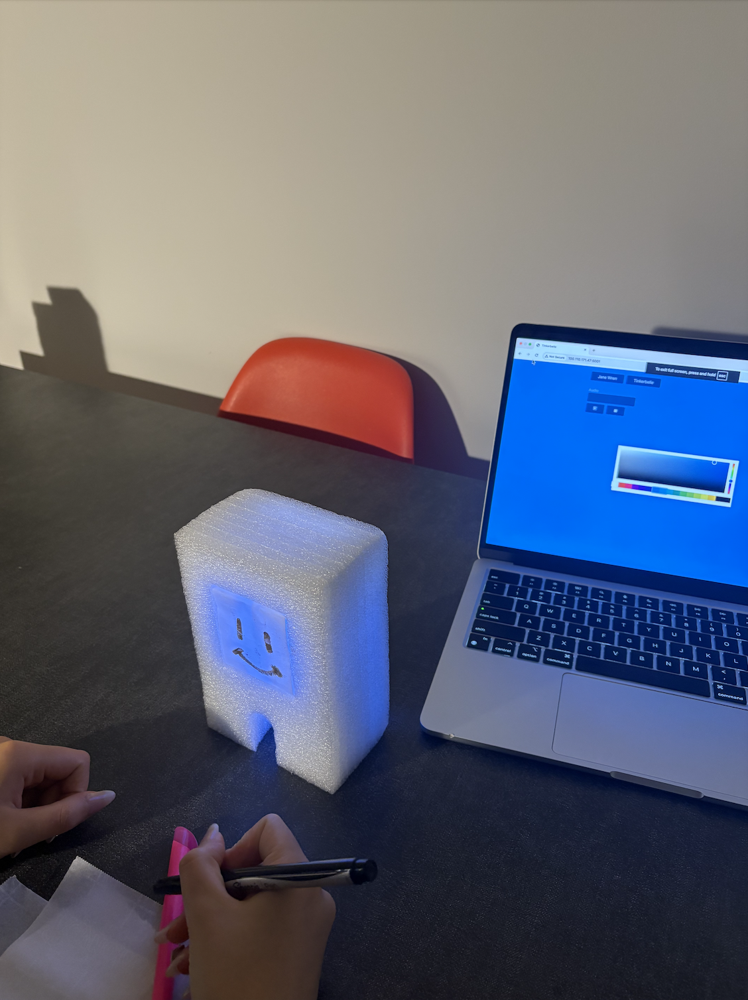
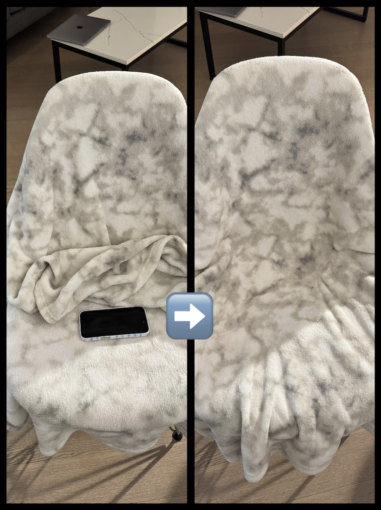

# Staging Interaction

**Contributors: Weicong Hong (wh528), Feier Su (fs495)**

## Lab Overview
For this assignment, you are going to:

A) [Plan](#part-a-plan) 

B) [Act out the interaction](#part-b-act-out-the-interaction) 

C) [Prototype the device](#part-c-prototype-the-device)

D) [Wizard the device](#part-d-wizard-the-device) 

E) [Costume the device](#part-e-costume-the-device)

F) [Record the interaction](#part-f-record)

Labs are due on Mondays. Make sure this page is linked to on your main class hub page.

## Part A. Plan 

### Plan 1. Healthy Chair

_Setting:_ The interaction may happen in classroom, library, or at home during study/work sessions (could be morning, afternoon, or late-night cramming).

_Players:_ The student/worker sitting in the chair would be the primary player. There could be classmates, roommates, or colleagues nearby, who may notice the light feedback and react (reminding, teasing, etc.).

_Activity:_ The student/worker sits in the chair while working. As they adopt different postures or behaviors, the chair’s built-in sensor detects whether their status is healthy and responds with light color changing. The student/worker notices the change in light and may self-correct posture, take a break, or ignore it. 
* Green = healthy sitting behavior
* Red = corrective alert (happens when leg shaking, leg crossing, slouching, sitting too long, etc.)

_Goals:_ The goal for the main player who sits on the interactive healthy chair is to maintain a good sitting posture and avoid unhealthy habits. The surrounding people could possibly support or monitor the main player’s behavior when noticing the light cue. 

### Plan 2. Medicine Box Reminder

_Setting:_ The interaction with the smart pillbox happens in a bedroom or a kitchen counter, usually at regular medication time such as in the morning or late at night. 

_Players:_ The main users in this scene is the patient, an elder who needs to remember to take prescribed medicine and occasional wellness supplements. 

_Activity:_ The activity begins when at the scheduled time, the pillbox glows red to indicate that it is time for the user to take a prescription pill. The patient notices the red light, opens the box, and takes the pill, which causes the light to turn off automatically. Later in the day, when it is time for a wellness medicine, the pillbox glows blue with a softer effect. If the user ignores the light for too long, the red reminder may pulse more brightly until acknowledged.
* Red light = prescribed pill (have to take)
* Blue ligh = wellness supplement 

_Goals:_ The goal of the users is to stay on top of their medication schedule without being interrupted. The pillbox’s goal is to provide a clear and reliable signal using light, and to acknowledge the action once the pill is taken. The interaction ensures a gentle but effective reminder system that blends seamlessly into the student’s daily routine.

### Plan 3. Student ID Card Reminder

_Setting:_ The interaction with the ID card reminder happens at the dorm door, where students naturally pass through on their way to class. The device is designed to fit this routine, acting as an unobtrusive reminder. The reminder is most important in the mornings, when the student is often in a rush and easily forgets the ID cards, but it can also play a role when they return in the evening.  

_Players:_ The main player is the student, who needs to take their student ID for access to the buildings, dining halls, or class. 

_Activity:_ When students are rushing to leave for class and forget to pick up their ID card, the device begins to glow red, signifying that the card has been left behind. If the student notices, they return, grab the ID card, and the light flickers and turns off. Later in the day, when the student comes back home, the device glows blue to remind them to put the card back in the holder so it can be easily found for the next outing.

_Goals:_ The goal of each player is to avoid the inconvenience of being locked out or unable to access the building because of a forgotten ID card. The device itself is to provide timely reminders that fit into the natural flow of leaving and returning.

### Plan 4. Stress Ball

_Setting:_ The interaction may happen in the office, study room, or home workspace during work/study hours when stress tends to build up.

_Players:_ The primary players are users who experience stress while working. There could be colleagues/roommates/family members who may notice the glow and comment, either lightening the mood or showing concern.

_Activity:_ The stress ball rests idle on the desk. When feeling stressed, the user picks it up, squeezes it, and the light reacts with flashes and calming color shifts. Over time, the interaction helps the user relax; the stress ball dims and resets, ready for the next cycle. 

_Goals:_ The goal of the user is to find stress relief, stay calm and focused without breaking workflow too much. The stress ball encourages healthy stress release and helps relieve the user’s mood through light feedback. The surrounding people may gain an implicit understanding of the user’s stress level. 

### Feedback
During the lab, we mainly focused on exploring Tinkerbelle and brainstorming potential ideas together. Thus, we did not get a chance to gather feedback from classmates. We asked some friends later, they felt that the **Healthy Chair** idea was the most attractive product they would like to use if it became real.

## Part B. Act out the Interaction

**Are there things that seemed better on paper than acted out?**

One issue that came up with the healthy chair was visibility. We realized that if the lights are placed under the chair or around the legs, the user might not actually notice the color change while focusing on their work.

**Are there new ideas that occur to you or your collaborator that come up from the acting?**

Instead of (or in addition to) light on the chair, the feedback could come from a separate desk accessory so it enters the user’s visual field more naturally.
Adding multimodal cues could make the device harder to ignore without being disruptive, such as gentle vibration or soft audio chime.

## Part C. Prototype the device

**Feedback on Tinkerbelle**

We find that Tinkerbelle is useful for experimenting with color changes on our phone screens. However the tool does not allow us to control the brightness or intensity of the light, which makes it difficult to show subtle differences between a soft reminder and a strong alert. In addition, the colors available are very single and flat, and there’s no option for gradients.

## Part D. Wizard the device

**Device Set-up**

To wizard the device, we decided to use the Tinkerbelle tool. One of us would remotely control the light changes, while the other played the actor, sitting in the chair and intentionally trying different unhealthy postures (leg shaking, crossing legs, slouching, prolonged sitting) to simulate triggers. This setup allowed us to stage the interaction where the light changes appeared in sync with the actor’s behaviors, even though the sensing was controlled manually. 

View our set up video at: https://youtube.com/shorts/vQvMvgtc-14?feature=share

**Design Iteration: Goal Changing**

We realized that surrounding people noticing the light could add a social feedback loop (e.g., peers teasing when the red light comes on). This might be motivating in some contexts, but could also embarrass the user. We need to give users control over how “public” the signals are.

To achieve the goal of turning off light signals, we would like to introduce a manual control feature, which could be a simple “tap” gesture. Users can tap the chair, or the associated desk light accessory, to acknowledge the signal and silence it.

## Part E. Costume the device

A main concern is visibility since the light change must be easily noticed even when the user is focused. At the same time, the device could have an aesthetic look, blending into the workspace as a pleasant object (like a desk accessory) rather than feeling like a corrective tool.

**Cloud-shaped Desk Decorator**

The cloud decorator is an attractive object on the desk even when idle. Its shape and materials naturally diffuse light, ensuring color changes are soft yet highly visible in the user’s direct line of sight. The light feels less like a warning system and more like a calming/playful presence.

**Light Strip around the Chair**

A light strip around the sitting area could provide subtle, body-centered feedback. With the lighting integrated into the chair, the user can see the glow peripherally. Yet it might be hard for users to notice the light change during the work.

**Paper Desk Lamp**

A paper lamp could be used as a practical light source. It creates an opportunity for the device to be both functional furniture and health-supporting technology.

**Final Costume Design Choice**

We’ve decided to pick the cloud form as the final design in consideration of its soft, approachable appearance and its ability to diffuse light evenly, making color changes both noticeable and pleasant to look at. Also, its compact form makes it flexible to place in different environments, such as room desk and office desk, while remaining safe and unobtrusive. 

The material we would use for the cloud-form costume for the device is cotton stuffing, which creates a soft and fluffy texture that naturally diffuses the phone light inside.

## Part F. Record

View our final prototyped interaction video at: https://youtube.com/shorts/rMiUTPYgeGw?feature=share

# Staging Interaction, Part 2 

## Part A. Plan

### Feedback

**Feedback from Professor Wendy Ju:**
Professor Ju noted that there is not yet a clear mapping between the sitting posture problem and the chosen cloud form. The cloud metaphor seems more connected to emotional or mood-related communication (e.g., glowing blue when a friend is sad) rather than posture correction. She suggested reconsidering the format to make it more meaningfully tied to posture feedback.

**Feedback from peer reviews:**
One interesting comment we received is that “how public the warning cue is,” as we briefly mentioned in Lab 1a, could be an important factor to take into consideration. We realized that while public signals can create social accountability, they can also embarrass the user. This highlights the need to carefully design for different levels of visibility and privacy for users to customize.

### Redesign Plan

After gathering feedback, we decided to switch the costume from a cloud to a chair-like desk robot. This new form is more aligned with the concept of posture correction and provides a clearer mapping between the device’s signals and the user’s sitting behavior. We also improved the alert system by adding sound and vibration, giving users stronger and more intuitive signifiers. Another improvement is offering users the choice to tap the robot to shut down the interaction when they don’t need reminders. In that case, the robot remains as an emotional companion, providing presence and comfort rather than corrective feedback.

**Storyboard #1: Long-time Sitting**

_Setting:_ The interaction takes place in personal room, study space, or workplace, where the user is working at a desk for an extended period of time.

_Players:_ The main player would be the chair user, who is focused on studying/working but tends to remain seated for too long. The chair sensor would detect prolonged sitting, and the desk robot would react with feedback through light, facial expressions, and subtle sound cues.

_Activity:_ The user sits and works with good posture. After a long time, the chair sensor detects continuous sitting and signals the desk robot. The robot changes its glow from blue to yellow with a pained expression. When the user ignores the warning, the chair begins to vibrate gently as a secondary reminder. Finally, the user notices, stands up to stretch, and the robot returns to blue with a happy expression.

_Goals:_ The goal is to remind the user to take breaks and avoid unhealthy long-term sitting.

**Storyboard #2: Ignoring the Warning**

_Setting:_ The interaction may happen in a classroom, library, or at home during study/work sessions.

_Players:_ The primary player is the person sitting on the chair, receiving cues from the desktop robot. The secondary players could be classmates, roommates or colleagues nearby who may notice the robot’s glow and expressions.

_Activity:_ The user works at their desk while the robot companion sits nearby. As the user adopts unhealthy postures, the chair’s sensor detects changes and the robot responds. As the user ignores the robot’s red glow and sad face and remains in an unhealthy posture, the robot plays a gentle audio cue to draw the user's attention. Once the user corrects their posture and sits normally again, the robot’s face shifts to a smile and the glow turns blue.

_Goals:_ The goal for the user is to maintain good posture, reduce unhealthy sitting habits, and receive gentle but clear feedback. The robot aims to encourage healthy sitting by providing both visual and auditory cues, while making the feedback feel more personable and engaging. People nearby may observe the robot’s reactions and help reinforce posture correction.

**Storyboard #3: Social Setting**

We realized the awkwardness might arise when the posture reminder activates in a shared space. If the robot glows red in front of others, the user may feel embarrassed. To address this, we designed an option that lets the user tap once to silence the warning (keeping the robot blue) or tap twice to turn the glow/robot off completely. This gives the user more control and flexibility, balancing social comfort with posture awareness.

_Setting:_ The interaction may happen in a shared workspace with multiple people present.

_Players:_ The primary player is The student who receives the posture warning. Other players include the desk robot that provides light feedback and other people in the room who may notice the warning.

_Activity:_ The robot glows red to signal unhealthy posture, making the user feel awkward. The user may tap the robot once to silence the warning (change it to the default blue glow) or tap twice to turn the glow/robot off completely.

_Goals:_ The goal is to allow user to manage the visibility of feedback in social situations, reduce embarrassment, and provide flexibility while supporting posture awareness.

## Part B-D. Acting, Prototyping, and Wizarding the device

Since Tinkerbelle worked well in Part 1a for controlling light color changes, we decided to continue using it (Tinkerbelle set-up video: https://youtube.com/shorts/vQvMvgtc-14?feature=share). For the additional modalities of robot expressions, audio cues, and vibration, we developed different approaches to simulate them during wizarding:

Robot’s expression: We created a set of hand-drawn paper face cards that can be manually inserted and swapped. With the light shining through, people can clearly see changes in the light color and the robot’s expressions.

Audio cues: While Tinkerbelle includes some built-in sounds, we found none that were gentle enough for a subtle, non-disruptive warning. Instead, we used a separate device to play soft chimes in sync with the actor adopting an unhealthy posture.

View our audio set-up video at: https://youtube.com/shorts/5mVurf53QhA?feature=share 

Vibration: To simulate vibration feedback, we placed a phone in vibration mode on the chair. By making calls to the phone, we could trigger vibrations remotely and in real time as part of the staged interaction.

View our vibration set-up video at: https://youtube.com/shorts/DQBPNYUqo4M?feature=share 

This setup allowed us to effectively wizard all modalities, including light, expression, sound, and vibration, making the device respond naturally to the actor’s posture changes.

## Part E. Costume the device

We used a foam roller as the outer shell. The foam was easy to shape into the form of a small chair-like robot. Also, such material does not block the light diffusion from the phone, allowing the glow to remain visible. To convey the robot’s facial expressions, we would use hand-drawn semi-transparent paper cards slotted in the foam.

For the vibration element, we would place the phone on the chair itself, underneath a thin felt blanket. The felt fabric concealed the phone visually while still allowing the vibration feedback to be sensed clearly by the actor. This helps keep the vibration experience body-centered (linked directly to sitting posture), while the robot remains a separate light/sound companion on the desk.

## Part F. Record

**Unhealthy posture scenario:** https://youtube.com/shorts/bkxQC-ossbo 

**Long-time sitting scenario:** https://youtube.com/shorts/X-NicvvVHO4 

*In this video, we also demonstrate how users interact with the robot to turn off the alert system and the device.

