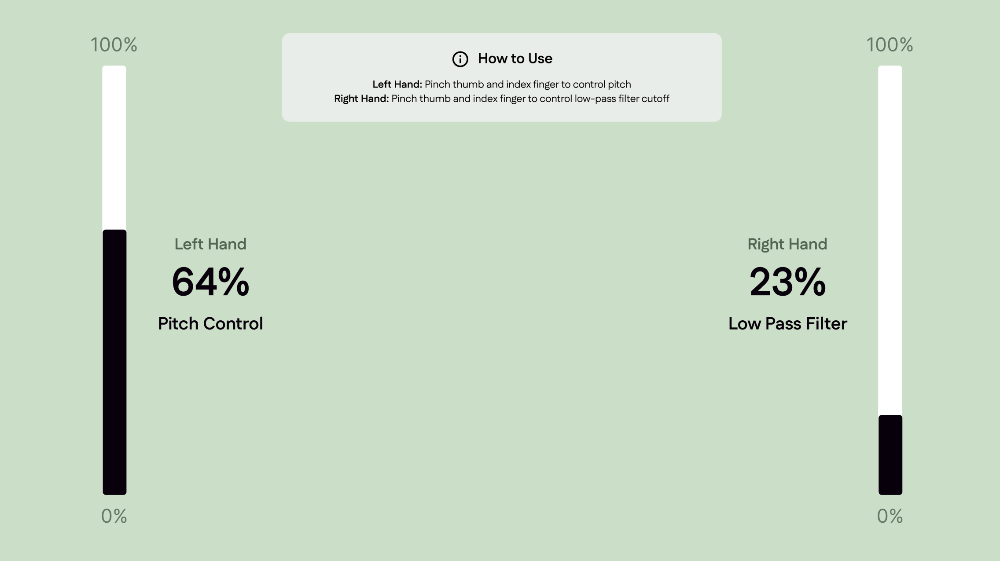

# Observant Systems

**Jully Li (hl2568), Weicong Hong (wh528), Feier Su (fs495), Sirui Wang (sw2449)**

## Part 1
### Part B
### Construct a simple interaction.

#### Gesture DJ 2.0
- Concept: Use hand gestures to control music
- Description: For this lab, we built a gesture-based sound controller using MediaPipe Hands on the Raspberry Pi. The interaction is based on using simple hand gestures to modulate sound in real time. Specifically, the pinch distance between the thumb and index finger of the hand controls music volume.

In experimentation, we tested the system under different lighting, camera angles, and backgrounds to observe detection stability. The MediaPipe hand model performed well with distinct hand shapes, but lost tracking under low light or when the hand was partially out of frame.

### Part C
### Test the interaction prototype

**Observation Notes**

1. When does it what it is supposed to do?
```
- Stable tracking with good, even lighting.
- An entire hand being captured by the camera.
- Single hand centered in frame.
- Clear index–thumb pinch gesture facing the camera.
- Slow clear movements.
```
2. When does it fail?
```
- Low light / backlighting
- Hand partially out of frame, making pinch distance become unreliable
- High-speed gestures
- Multiple hands/people entering the frame, causing wrong hand selection
- Non-stable/shaking camera
```
3. When it fails, why does it fail?
```
- Low light / backlighting: The webcam sensor struggles to detect edges and contrast when illumination is uneven; the hand becomes underexposed, causing the model to misread contours and landmark points.
- Hand partially out of frame, making pinch distance become unreliable: The algorithm depends on seeing both fingers fully to measure pinch distance or classify a pose.
- High-speed gestures: Rapid movement causes motion blur, making frames appear smeared.
- Multiple hands/people entering the frame, causing wrong hand selection: When the model tries to track several candidates simultaneously, it may assign the wrong landmarks to the active user.
- Non-stable/shaking camera: When the camera moves, the background and relative hand position both shift.
```
4. Based on the behavior you have seen, what other scenarios could cause problems?
```
- Gloves, rings, or long sleeves (partially) covering fingers.
- Shadows casting finger-like edges.
- Background hands/objects (posters/hand images) close to the camera field.
- Non-frontal hand poses (e.g., thumb hidden behind palm).
- User fatigue; lacking accessibility considerations on hand tremors or limited range of motion.
```

**System Descriptions**

1. Are they aware of the uncertainties in the system?
```
Users might not be fully aware of the underlying uncertainties. When the pitch suddenly jumps or the volume cuts out, they may assume they made an incorrect gesture rather than realizing that the hand-tracking model temporarily lost confidence. 
```

2. How bad would they be impacted by a miss classification?
```
A misclassification here is relatively low-impact, it just creates an unexpected or off-key sound rather than a critical failure. However, frequent noise, pitch spikes, or muted moments could disrupt the creative flow or make the experience feel inconsistent. 
```

3. How could change your interactive system to address this?
```
- State + confidence UI: On-screen overlay with per-hand confidence bars; color-code stable/unstable.
Auditory safety rails:
- Clamp pitch to a musical scale; glide (portamento) between notes.
- Volume ramp (attack/release) to avoid pops when confidence drops.
- Role locking: Explicit “Calibrate” gesture to lock which hand controls pitch/volume; show labels on-screen.
- Accessibility mode: Larger pinch thresholds, steadier smoothing, optional dwell-based input.
```

4. Are there optimizations you can try to do on your sense-making algorithm.
```
- Confidence-gated pipeline: Only emit volume updates if both the hand score and the two landmark visibilities (thumb/index tips) exceed a threshold.
- Outlier rejection + temporal smoothing
- Non-linear mapping for better control: Map pinch distance → volume with a non-linear function
```

### Part D
### Characterize your own Observant system

**Observant System Characterizations**

* What can you use X for?
```
- Hands-free, real-time system volume control by pinching thumb–index (maps pinch distance → 0–100%).
- One-gesture mute: the “quiet coyote!” (mixed long/short inter-finger distances) forces volume to 0%.
```
* What is a good environment for X?
```
Even front lighting, uncluttered background, single hand centered and fully in frame.
```
* What is a bad environment for X?
```
- Low light, backlighting, or fast motion.
- Multiple hands/people in frame, or hands partially off-screen/occluded.
```
* When will X break?
```
Input assumptions violated: Hand landmarks not returned (no hand / lost tracking) → UI keeps drawing old bar; volume stays at last value.
```
* When it breaks how will X break?
```
No hand detection (e.g., detectionCon=0): landmarks empty most frames → volume never updates, bar stays at last drawn, music continues at last set loudness.
```
* What are other properties/behaviors of X?
```
- Starts at 50% volume unconditionally (set_volume(50) at boot).
- Linear mapping from pinch distance 50→300 px to 0→100% (no smoothing/hysteresis; can feel twitchy).
```
* How does X feel?
```
- Immediate and expressive when lighting is good and motion is moderate.
- Occasionally surprising: mute snaps on/off when the “quiet coyote!”; volume can spike if distance briefly jumps.
```

**Source code:** https://github.com/siruiii/Interactive-Lab-Hub/blob/4fc51543e8a3d962f654d912089122a11d45ea90/Lab%205/dj2.py

**Videos:**

https://youtube.com/shorts/OTi3Ou8AaQY?feature=share

https://youtube.com/shorts/SH_TeEvClkg?feature=share


## Part 2

### User Testing on the Part 1 Design
We tested and iterated our prototype from **1st week (only Volume Control)** with three users:

```
User Feedback 1:
“It’s simple but interesting. I like that I can adjust the volume just by moving my hand without touching anything.”

User Feedback 2:
“It feels like the system could do more, maybe control other aspects of the music, like pitch or tone, to make it more expressive.”
```

Overall, users found the prototype intuitive and engaging, appreciating the touchless volume adjustment as a unique interaction method. However, users expressed interest in expanding functionality beyond volume control.

**Video of user testing with one of the users:** https://youtu.be/qgfThVijR9s


### Iteration #1: Implemented Pitch Control and Low Bass Filter Control

Based on the feedback, we expanded the system to support pitch modulation and low-pass filter control, allowing users to control both tone and texture of the sound in real time. The vertical position of the index finger was mapped to pitch frequency, while the proximity of the hand was used to adjust the low-pass filter, producing a muffled effect when the hand was close. This version created a fuller, more dynamic sound experience and encouraged users to explore hand gestures more playfully. During testing, participants described it as feeling “like sculpting music,” though a few still found it challenging to know exactly how far to move their hand for the intended effect, pointing to the need for better user guidance.

```
User Feedback 1:
“Now it actually feels like a music controller! Being able to change both pitch and bass makes it feel more dynamic and fun.”

User Feedback 2:
“Sometimes it’s hard to control just one thing. I’m not sure if my hand is changing the pitch or the bass. Maybe add visual feedback to show which mode I’m in.”

User Feedback 3:
“It took me a few tries to figure out how to get consistent sounds. Some guidance on gesture range or sensitivity would help.”
```

**Source Code:** [https://github.com/siruiii/Interactive-Lab-Hub/blob/Fall2025/Lab%205/dj2b2.py](https://github.com/siruiii/Interactive-Lab-Hub/blob/Fall2025/Lab%205/dj2b2.py)

**Iteration #1 Video:** https://youtu.be/le4BOyuG8to


### Final Deliverable / Iteration #2: Added User Interface with Instruction on how to control the device

Our second iteration focused on improving learnability and feedback by designing a visual user interface that teaches users how to control the Gesture DJ 2.0 system in real time. Earlier testing revealed that users might struggle to understand which gesture mapped to which control and lacked awareness when tracking confidence dropped.

As shown below, we designed a minimalist UI that visualizes both hands’ real-time control values and displays a concise instruction panel at the center of the screen.


```
User Feedback 1:
“The interface makes a huge difference. I immediately understood what each gesture does after reading the instructions.”

User Feedback 2:
“It’s much more polished now. I can clearly see how to control the sound, and the interaction feels intentional rather than experimental.”
```

**Source Code:** [https://github.com/siruiii/Interactive-Lab-Hub/blob/Fall2025/Lab%205/dj2b2.py](https://github.com/siruiii/Interactive-Lab-Hub/blob/Fall2025/Lab%205/dj2b-ui.py)

**Final Deliverable Video:** https://youtu.be/QUjoMvDYDVA 

**Team Contribution: Everyone in the team has made equal contributions to this project.**
- Jully Li: help with device setup, UI screen design, user testing, final report write-up
- Sirui Wang: technical implementation and iteration, Raspberry Pi setup, device testing
- Sophie Su: help with device setup, user testing, video recording, final report write-up
- Weicong Hong: help with device setup, user testing, video recording, final report write-up
