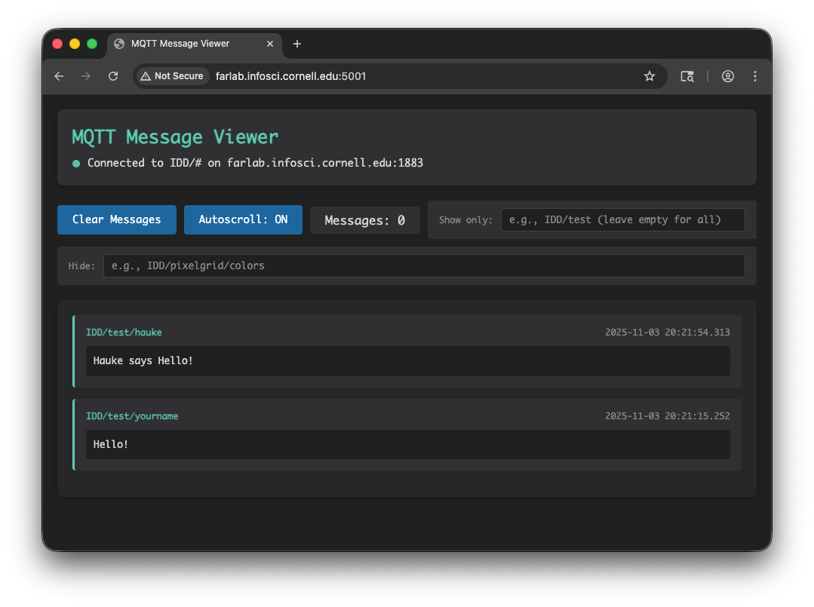
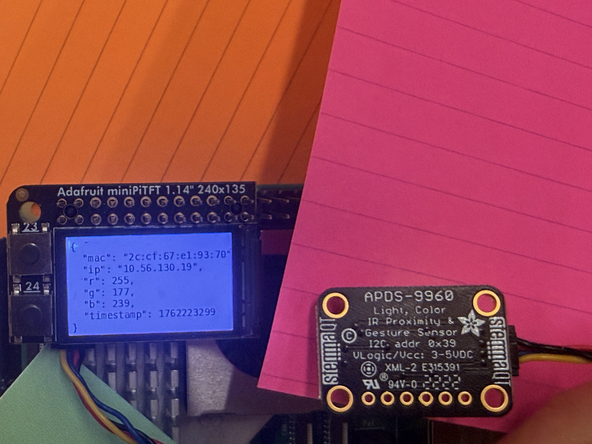
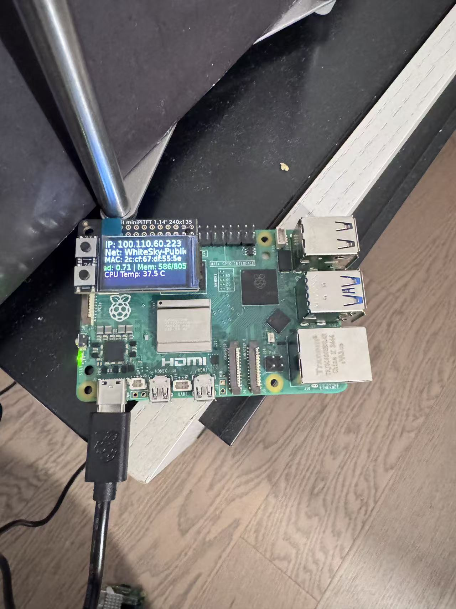
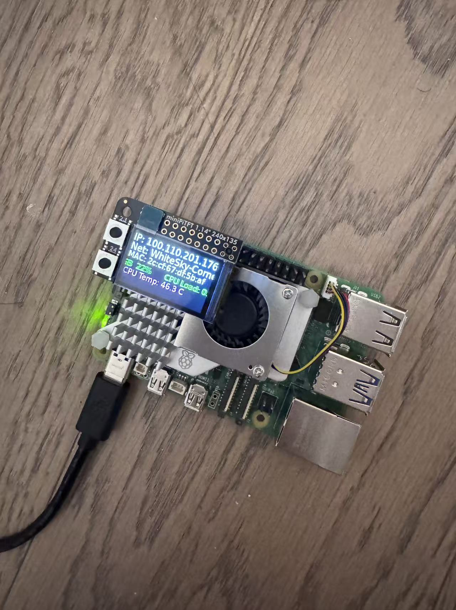
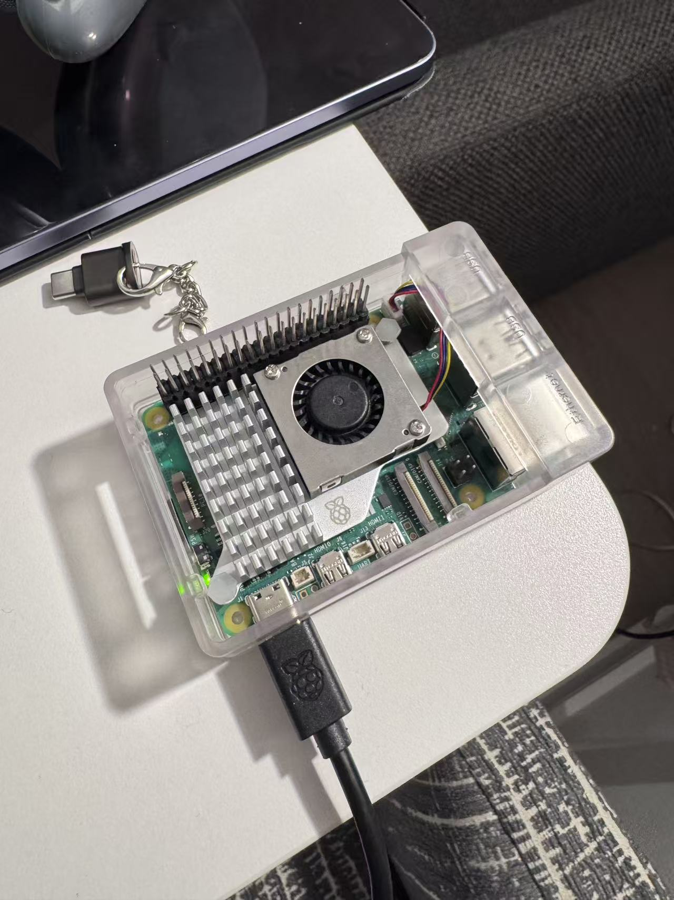
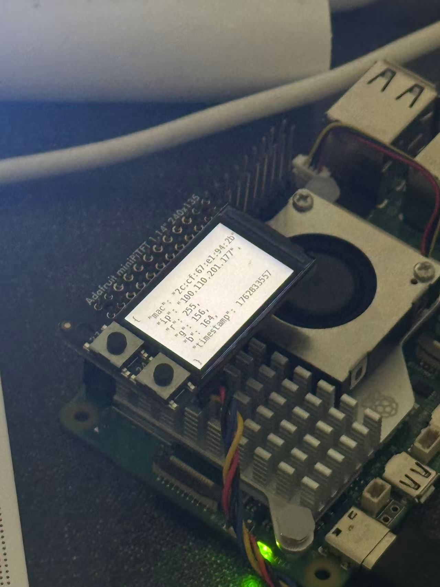
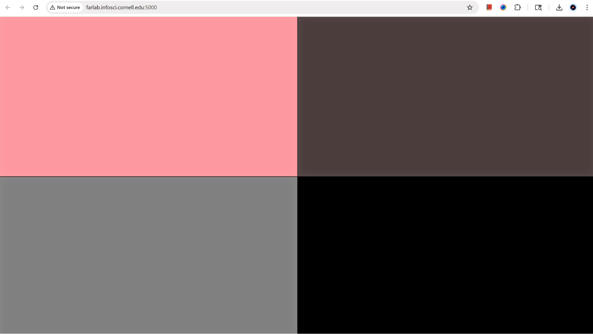
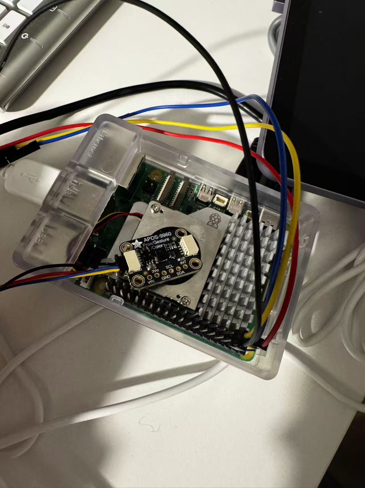

# Distributed Interaction

**COLLABORATORS: Jully Li (hl2568), Weicong Hong (wh528), Feier Su (fs495), Sirui Wang (sw2449)**

<details>
For submission, replace this section with your documentation!

---

## Prep

1. Pull the new changes
2. Read: [The Presence Table](https://dl.acm.org/doi/10.1145/1935701.1935800) ([video](https://vimeo.com/15932020))

## Overview

Build interactive systems where **multiple devices communicate over a network** using MQTT messaging. Work in teams of 3+ with Raspberry Pis.

**Parts:**
- A: Learn MQTT messaging
- B: Try collaborative pixel grid demo  
- C: Build your own distributed system

---

## Part A: MQTT Messaging

MQTT = lightweight messaging for IoT. Publish/subscribe model with central broker.

**Concepts:**
- **Broker**: `farlab.infosci.cornell.edu:1883`
- **Topic**: Like `IDD/bedroom/temperature` (use `#` wildcard)
- **Publish/Subscribe**: Send and receive messages

**Install MQTT tools on your Pi:**
```bash
sudo apt-get update
sudo apt-get install -y mosquitto-clients
```

**Test it:**

**Subscribe to messages (listener):**
```bash
mosquitto_sub -h farlab.infosci.cornell.edu -p 1883 -t 'IDD/#' -u idd -P 'device@theFarm'
```

**Publish a message (sender):**
```bash
mosquitto_pub -h farlab.infosci.cornell.edu -p 1883 -t 'IDD/test/yourname' -m 'Hello!' -u idd -P 'device@theFarm'
```

> **💡 Tips:**
> - Replace `yourname` with your actual name in the topic
> - Use single quotes around the password: `'device@theFarm'`

**🔧 Debug Tool:** View all MQTT messages in real-time at `http://farlab.infosci.cornell.edu:5001`



**💡 Brainstorm 5 ideas for messaging between devices**

---

## Part B: Collaborative Pixel Grid

Each Pi = one pixel, controlled by RGB sensor, displayed in real-time grid.

**Architecture:** `Pi (sensor) → MQTT → Server → Web Browser`

**Setup:**

1. **Sensor**

#### Light/Proximity/Gesture sensor (APDS-9960)
We use this sensor [Adafruit APDS-9960](https://www.adafruit.com/product/3595) for this exmaple to detect light (also RGB)
 


Connect it to your pi with Qwiic connector



We need to use the screen to display the color detection, so we need to stop the running piscreen.service to make your screen available again

```bash
# stop the screen service
sudo systemctl stop piscreen.service
```

if you want to restart the screen service
```bash
# start the screen service
sudo systemctl start piscreen.service
```
 
2. **Server** (one person on laptop):
```bash
cd "Lab 6"  
source .venv/bin/activate
pip install -r requirements-server.txt
python app.py
```

2. **View in browser:**
   - Grid: `http://farlab.infosci.cornell.edu:5000`
   - Controller: `http://farlab.infosci.cornell.edu:5000/controller`

3. **Pi publisher** (everyone on their Pi):
```bash
# First time setup - create virtual environment
cd "Lab 6"
python -m venv .venv
source .venv/bin/activate
pip install -r requirements-pi.txt

# Run the publisher
python pixel_grid_publisher.py
```

Hold colored objects near sensor to change your pixel!


**📸 Include: Screenshot of grid + photo of your Pi setup**

---

## Part C: Make Your Own

**Requirements:**
- 3+ people, 3+ Pis
- Each Pi contributes sensor input via MQTT
- Meaningful or fun interaction

**Ideas:**

**Sensor Fortune Teller**
- Each Pi sends 0-255 from different sensor
- Server generates fortunes from combined values

**Frankenstories**
- Sensor events → story elements (not text!)
- Red = danger, gesture up = climbed, distance <10cm = suddenly

**Distributed Instrument**
- Each Pi = one musical parameter
- Only works together

**Others:** Games, presence display, mood ring

### Deliverables

Replace this README with your documentation:

**1. Project Description**
- What does it do? Why interesting? User experience?

**2. Architecture Diagram**
- Hardware, connections, data flow
- Label input/computation/output

**3. Build Documentation**
- Photos of each Pi + sensors
- MQTT topics used
- Code snippets with explanations

**4. User Testing**
- **Test with 2+ people NOT on your team**
- Photos/video of use
- What did they think before trying?
- What surprised them?
- What would they change?

**5. Reflection**
- What worked well?
- Challenges with distributed interaction?
- How did sensor events work?
- What would you improve?

---

## Code Files

**Server files:**
- `app.py` - Pixel grid server (Flask + WebSocket + MQTT)
- `mqtt_viewer.py` - MQTT message viewer for debugging
- `mqtt_bridge.py` - MQTT → WebSocket bridge
- `requirements-server.txt` - Server dependencies

**Pi files:**
- `pixel_grid_publisher.py` - Example (RGB sensor → MQTT)
- `requirements-pi.txt` - Pi dependencies

**Web interface:**
- `templates/grid.html` - Pixel grid display
- `templates/controller.html` - Color picker
- `templates/mqtt_viewer.html` - Message viewer

---

## Debugging Tools

**MQTT Message Viewer:** `http://farlab.infosci.cornell.edu:5001`
- See all MQTT messages in real-time
- View topics and payloads
- Helpful for debugging your own projects

**Command line:**
```bash
# See all IDD messages
mosquitto_sub -h farlab.infosci.cornell.edu -p 1883 -t "IDD/#" -u idd -P "device@theFarm"
```

---

## Troubleshooting

**MQTT:** Broker `farlab.infosci.cornell.edu:1883`, user `idd`, pass `device@theFarm`

**Sensor:** Check `i2cdetect -y 1`, APDS-9960 at `0x39`

**Grid:** Verify server running, check MQTT in console, test with web controller

**Pi venv:** Make sure to activate: `source .venv/bin/activate`


---

## Submission Checklist

Before submitting:
- [ ] Delete prep/instructions above
- [ ] Add YOUR project documentation
- [ ] Include photos/videos/diagrams  
- [ ] Document user testing with non-team members
- [ ] Add reflection on learnings
- [ ] List team names at top

**Your README = story of what YOU built!**

---

Resources: [MQTT Guide](https://www.hivemq.com/mqtt-essentials/) | [Paho Python](https://www.eclipse.org/paho/index.php?page=clients/python/docs/index.php) | [Flask-SocketIO](https://flask-socketio.readthedocs.io/)

</details>

## Part A: MQTT Messaging
### 💡 MQTT Brainstorming (5 ideas)
#### 1) Emotion Lamps
Concept: 
Each Pi is a personal lamp. When someone sets their color/brightness, that “mood” ripples to others via MQTT, creating ambient, nonverbal presence across distance with gentle social synchrony.

Message Flow:
publish: IDD/mood/<user> → {"color":"#3366ff","brightness":0.7}
subscribe: all lamps blend/mirror incoming moods (e.g., weighted average or ripple animation).

#### 2) Distributed RGB Mixer (Tri-Station)
Concept: 
Three stations each control one channel (R/G/B) with gestures; any display mixes live color. Everyone's input is visibly essential.

Message Flow:
publish: IDD/rgb/<group>/set → {"r":120,"g":null,"b":200}
subscribe: mixers merge latest non-null channels and render.

#### 3) Proximity Color Bridge
Concept: 
Two lamps “link” when users bring their devices close (detected by distance sensor), temporarily sharing color states. It makes spatial relationships a networking trigger

Message Flow:
publish: IDD/link/<pair>/status → {"linked":true}
publish (while linked): IDD/link/<pair>/color → {"from":"A","color":"#ff5599"}
subscribe: partner lamp mirrors/blends while linked; unlinks on timeout.

#### 4) Rhythm Mesh (Beat & Sync)
Concept: 
One Pi is a tempo source; others contribute pattern density/accents to a shared light/sound metronome.

Message Flow:
publish (conductor): IDD/tempo/<group> → {"bpm":96,"phase":0.42}
publish (peers): IDD/pattern/<user> → {"accent":[0,1,0,0], "intensity":0.6}
subscribe: nodes render synchronized pulses.

#### 5) Door/Space Status Signal
Concept: Sensors publish room states (door open, occupancy, noise level); hallway signal change color accordingly; could be used as real utility + privacy-aware summarization

Message Flow:
publish: IDD/space/<room>/state → {"door":"open","people":3,"noise":0.2}
subscribe: beacons map states to colors (e.g., red=busy, green=free).

## Part B: Collaborative Pixel Grid
### 📸 Pi setup





### 📸 Screenshot of grid 



## Part C: Make Your Own
### Tri-Station RGB (3 Pis, 3 sensors, MQTT)
#### 1. Project Description
Our distributed system visualizes collaborative color creation across multiple Raspberry Pis. Each Pi represents one color channel: Red, Green, or Blue, and uses a proximity/light sensor (APDS-9960) to measure the amount of light or closeness of an object. The closer or brighter the object, the stronger that channel’s intensity (0-255). All three Pis publish their readings to a shared MQTT broker, where the values are combined on a central Flask + WebSocket server. The blended color is shown live on a web interface (a colored square that updates in real time).
#### 2. Architecture Diagram
**Hardware, connections, data flow**
- Pi-R: APDS-9960 proximity -> R (0 = far -> 0 red; 255 = close -> 255 red)
- Pi-G: APDS-9960 proximity -> G
- Pi-B: APDS-9960 proximity -> B

**Label input/computation/output**
- Input: APDS-9960 (Proximity Sensor) -> Raw 0-255 Reading
- Computation: each Pi -> MQTT Publish (IDD/rgb/set) -> Broker -> Central Flask Server (Subscribes and Mixes RGB)
- Output: OLED -> Display of Combined Color + Channel Values (R,G,B)
#### 3. Build Documentation
- refer to the GPIO pins: https://learn.sparkfun.com/tutorials/introduction-to-the-raspberry-pi-gpio-and-physical-computing/gpio-pins-overview
- set up and connect the APDS-9960 to the pi



- test connectivity with the python script given in Lab 4: https://github.com/siruiii/Interactive-Lab-Hub/blob/e6312114cebcaae3c90d2ad0683775de933f11d8/Lab%204/proximity_test.py

**Pi-1 as both the server and client**
```python
# terminal 1 (server)
cd rgb-proximity
pip install -r requirements.txt
hostname -I # record to use for other clients
python app.py # go to 0.0.0.0:5000 or localhost:5000

# terminal 2 (client - red)
python3 pi/proximity_publisher.py --pi-id pi_red --host localhost --port 1883 --mode apds9960 --near-cm 5 --far-cm 80 --debug
```
**Pi-2 and Pi-3 as clients**
```python
# (client - green), replace hostname with Pi-1's ip address
python3 pi/proximity_publisher.py --pi-id pi_green --host hostname --port 1883 --mode apds9960 --near-cm 5 --far-cm 80 --debug

# (client - blue), replace hostname with Pi-1's ip address
python3 pi/proximity_publisher.py --pi-id pi_blue --host hostname --port 1883 --mode apds9960 --near-cm 5 --far-cm 80 --debug
```

- open `0.0.0.0:5000 or localhost:5000` to view the collaborative color creation
#### 4. User Testing
- Participants: 3 users collaboratively testing the distributed system
- individual testing: https://youtube.com/shorts/CXWO7DWEKEI?si=dwUA3BNMexmJMCtY
- collabration: https://youtu.be/3GFww_l1DMc?feature=shared

**What did they think before trying?**
```
- They expected each Pi to work separately. 
- They discovered how hand distance from each sensor affected the mix. 
- When all three moved hands at once, they saw smooth color transitions and tried to match target colors for fun.
```

**What surprised them?**
```
They were surprised by how small movements affected group color. They liked the immediacy of seeing everyone’s contribution.
```

**What would they change?**
```
- Add color name for feedback
- Add visual feedback on each station to see individual intensity.
- Include sound or vibration when all three channels reach balance (white light).
- Make the web UI larger or include RGB value numbers.
```

#### 5. Reflection
**What worked well?**
```
- MQTT communication was smooth
- Physical collaboration made abstract networking concepts tangible.
- The color blending reinforced interdependence. No single Pi could control the full outcome.
```
**Challenges with distributed interaction?**
```
- Each APDS-9960 had slightly different baseline proximity readings.
- Ambient lighting caused noisy color shifts.
- One Pi occasionally dropped connections.
```

**How did sensor events work?**
```
- Our sensors worked through a continuous stream of proximity readings from each APDS-9960, where every Pi translated distance into a color intensity value and published it to the MQTT broker. 
- The server combined the latest red, green, and blue inputs to generate a blended color that updated instantly on the web interface. 
- Each person’s movement directly affected the shared outcome.
```

**What would you improve?**
```
- We would make the sensors more consistent. 
- Add slider UI on the screen to show each color’s value.
- Improve the sensor reading so the color changes in real time.
```

#### Contribution
- Jully Li: Raspberry Pi setup, final report write-up
- Sirui Wang: technical implementation and iteration, device testing
- Sophie Su: Raspberry Pi setup, video recording, final report write-up
- Weicong Hong: Raspberry Pi setup, video recording, final report write-up
- Use of AI: we used ChatGPT to help debug the MQTT connection issue and revise the code for smoother communication between the PIs
